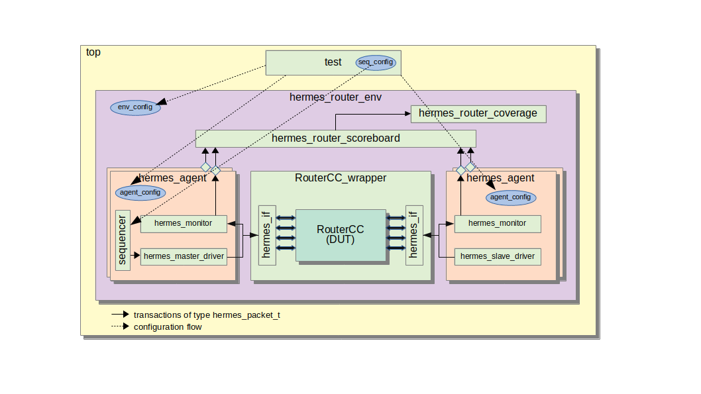

# Hermes Network-on-Chip Router Testbench

The DUT is the NoC router presented in the paper [HERMES: an infrastructure for low area overhead packet-switching networks on chip](https://www.sciencedirect.com/science/article/pii/S0167926004000185). The DUT is the central router illustrated in Fig below, with an 8-bit network address set in design time, 16-bit wide data channels, five master ports for incoming packets, five slave ports for outgoing packets. Although only the central router is simulated, it mimics the existence of a 3x3 NoC used just for routing address purposes. 


This UVM-based router TB is illustrated in the Fig below. It has one environment with 10 agents  (5 slaves and 5 master agents) each one attached to a different router port. It has several different types of randomization and constraints to generate valid packet headers and to randomize the time the packets and the flits are injected into the router. It uses virtual and hierarchical sequences to coordinate various sequences in parallel. It has a scoreboard and different coverage points/crosses. config_db, represented in the figure with dashed lines, distributes parameters to the environment and to its 10 agents. The agent (slave or master) is configured with factory override, changing the behavior of the driver. config_db is also used to pass parameters from tests to sequences. 




## The Testbench Architecture

This router TB is organized in three main modules:
 - [**hermes_router**](../): the router design where the RTL, netlist, top, simulation scripts, tests and sequences are located;
 - [**hermes_pkg**](../../vips/hermes_pkg/docs): contains the protocol dependent part of the testbench, i.e. the agent, both slave/master drivers, the monitor, interface, agent configuration class, and main design parameters;
 - [**hermes_router_env_pkg**](../../vips/hermes_router_env_pkg/docs): contains the router environment, which instantiates 5 slave and 5 master agents. It also contains the coverage module, the scoreboard, and the environment configuration class.

## Running the Tests

> $ git clone https://github.com/amamory/uvm-basics.git

> $ cd uvm-basics/noc-router/hermes_router/sim

> $ vsim -c -do run.do

## The Testbench Simulation Knobs

The [run.do](../sim/run.do) file has few parameter to change the type of simulation.

```
set SEED      "random"
set VERBOSITY "UVM_HIGH"
# set true to enable coverage
set COVERAGE  "true"      
# set true to simulate RTL, otherwise, simulates the netlist
set RTL_SIM   "true"
# set true to simulate for debug, otherwise simulate for speed/regression
set DEBUG_SIM "true" 
```

## Existing Sequences

There are 2 sequences named *repeat_seq* and *parallel_seq*. repeat_seq sends N transaction items into a single port sequentially. In this sequence, just the payload content is randomized. The rest of the transaction parameters are defined by the sequence configuration. parallel_seq is a virtual sequence that coordinates the parallel execution of repeat_seq sequences. parallel_seq has an additional parameter (*enable_port*) to set which sequences are enabled for parallel execution. The default is to have all sequences enabled.


## Existing Tests

There are 3 types of configurations: environment ([hermes_router_env_config](../../vips/hermes_router_env_pkg/src/hermes_router_env_config.sv)), agent ([hermes_agent_config](../../vips/hermes_pkg/src/hermes_agent_config.sv)), and sequence ([hermes_router_seq_config](../tb/seqs/src/hermes_router_seq_config.sv)) configurations. Each test in *build_phase* must set the environment and the agent configuration accordinly. There is only  one environment configuration and five agent configurations, where one agent configuration is set to each port direction (N, S, W, E, Local). The Sequence configuration is set in *run_phase*. Then this configuration is sent to its sequencer, and the sequence is started. Check the [repeat_test](../tb/tests/src/repeat_test.sv) for an example.

This is a list of existing tests:

| name            | Description                    | test param      |
| ---             | ---                            | ---             |
| |                | |
| base_test       | the base test class for all tests. it does not  implement run_phase| none            | 
| repeat_test     | injects 10 packets into the north port | repeat_sequence | 
| random_test     | injects 10 packets into a randomly selected ports  | none            | 
| sequential_test | injects packets in sequential port order, starting with the port 0.  | repeat_sequence |
| parallel_test   | uses a virtual sequence to inject packets in all input ports in parallel  | none            |
| bottleneck_test | uses a virtual sequence to inject packets in all input ports in parallel to the same target address, creating a bottleneck  | target_address  | 


## Creating New Tests

The easiest way is to derive new tests based on the existing ones. Then, just tweak the configuration knobs according to the goal of this new test. See the tests available [here](../tb/tests/src) and the sequences [here](../tb/seqs/src).

## Stuff to be done

This router TB is functional but there are more features I want to implement, in order of importance, such as:
 - Document the TB architecture, tests, sequences, checks, and coverage. Perhaps using Markdown and ReadTheDocs. *DONE !*
 - Set tests with plusargs, making the tests more configurable without recompilation and also reducing the number of tests. *DONE !, Although it would be possible to use more of this capability*
 - Include SV assertions in the DUT
 - netlist simulation with SDF annotation - *DONE !*
 - Design a Power Aware Simulation using Unified Power Format (UPF)
 - Describe sequences for error injection
 - Include a fault injection method with UVM and/or using formal methods, such as 
[How Formal Reduces Fault Analysis for ISO 26262](https://www.mentor.com/products/fv/resources/overview/how-formal-reduces-fault-analysis-for-iso-26262-82758134-85e7-4753-92f4-6f90e36e7d96)
 - More open-ended task would be to keep studying SV and UVM usage methods to improve the reuse for this testbench.
