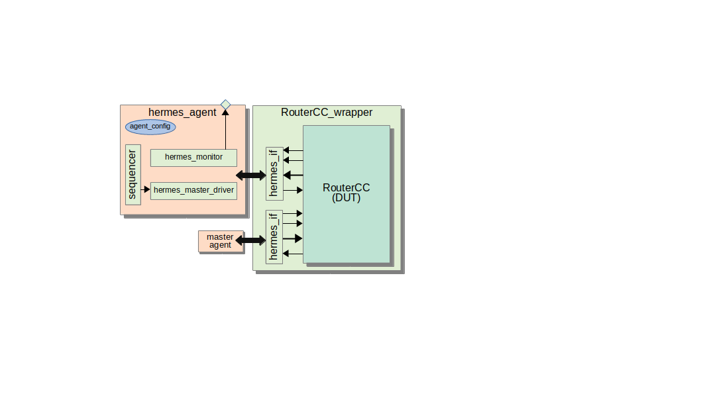
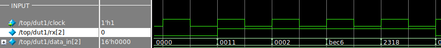
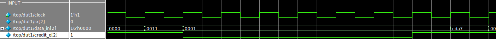
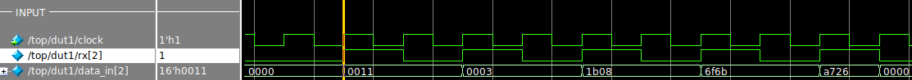
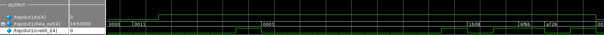

# Introduction

This doc describes the protocol dependent part of Hermes NoC, including interfaces, transactions, agents, drivers, and monitors. 

## hermes_agent

The agent has a sequencer, *hermes_monitor*, *hermes_agent_config*, and *hermes_base_driver*.  Depending on the agent mode (slave or master), 
the *hermes_base_driver* is replaced by  *hermes_master_driver* or *hermes_slave_driver*.  The image bellow show a hermes_agent with interface to a Hermes router.




The agent uses the following configuration parameters.

| name / type                  | Description                    | GET/SET | From/To        | 
| ---                          | ---                            | ---     | ---            |
| config / hermes_agent_config | config                         | get     | test           |
| if / hermes_if               | interface                      | get     | top            |
| if / hermes_if               | interface                      | set     | monitor/driver |
| mode / string                | slave/master                   | get     | env            |
| port / int                   | the port attached to the agent | get     | env            |


### hermes_if

The interface consists of the following terminals, for the master and slave port respectively. 

```SystemVerilog
    modport datain (
            input clk, avail, data,
            output credit
        );
    modport dataout (
            output clk, avail, data,
            input credit
        );
```

### hermes_packet_t

A packet transaction consists of a set of 16-bits words where the first is the header, where it informs the target router address, the second is the packet size, and the rest is the payload. The transaction allows randomization of:

- header: packet destination
- p_size: packet size in words of 16 bits
- payload: the actual content of the packet

The packet size can be small, medium, or large sized and  it is possible to change its random distribution.
The header is constrained based on the valid path of the XY routing algorithm. The function [hermes_pkg::valid_addrs](../src/hermes_typedefs.sv) returns the set of valid network addresses according to the input port. 


### hermes_agent_config

It has 3 parameters used by the *hermes_master_driver*:

- cycle2send: number of clock cycles waiting to send the transaction
- cycle2flit: number of clock cycles waiting to send the next flit
- master_driver_enabled: if it is disabled, then it is not supposed to drive incoming packets into the router. flag error if it does.

and one used by the *hermes_slave_driver*:

- cred_distrib: the probability of the slave port to accept an outgoing flit. 

The following piece of code of a test configures the NORTH agent different modes. 

```SystemVerilog
  if( !acfg[hermes_pkg::NORTH].randomize() with { 
      cycle2send == 1;
      cycle2flit == 0;
    }
```

When the NORTH input buffer is not full, the result is that credit is high and rx is continuous. Thus, flits are sent every cycle, 0011 (header), 0002 (size) , and bec6, 2318 (payload). 



However, when the buffer is full, the credit is low for few clock cycles, interrupting the transmission of the 3 flit packet 0011, 0001, cda7.



Then, if we change the agent configuration to:

```SystemVerilog
  if( !acfg[hermes_pkg::NORTH].randomize() with { 
      cycle2send == 1;
      cycle2flit == 1;
      cred_distrib == 3;
    }
```

In the master port we are going to see a flit sent every 2 clock cycles.



And in the slave port we see low credit most of the time, delaying the packet transmission.



### hermes_monitor

The monitor is always on, and has no distinct attribute or configuration other than the usual interface configuration.

### hermes_base_driver

The agent has a hermes_base_driver attribute. During *build_phase*, where the *mode* parameter is read, this driver is either converted to a *hermes_master_driver* or *hermes_slave_driver*.

### hermes_master_driver

It receives a transaction and sends it to the DUT via a master port. Its behaviour is affected by the *cycle2send*, *cycle2flit*, and *enable* agent parameters.

### hermes_slave_driver

Its only goal is to generate the credit to slave ports. The probability of high credit is determined by the *cred_distrib* agent parameter.