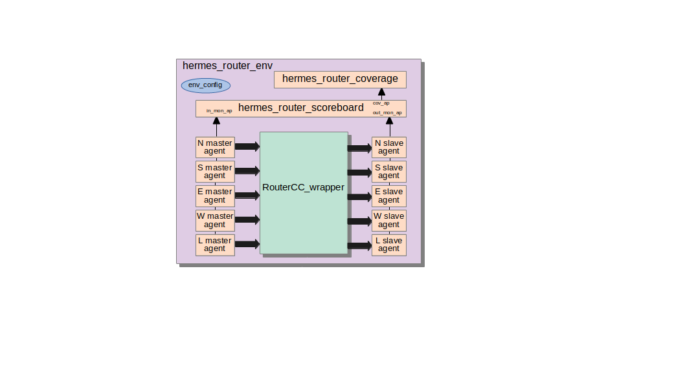

# Introduction

This document describes the environment to test a single Hermes router. It includes a coverage module, scoreboard, and an environment configuration class.

## hermes_router_env

The env has a *hermes_router_coverage*, *hermes_router_scoreboard*, *hermes_router_env_config*, an array of five slave and five master *hermes_agent*.  
It also connects the master agents to the scoreboard port for incoming packets (*scoreboard_h.in_mon_ap*) and connects the slave agents to the scoreboard port for outgoing packets (*scoreboard_h.out_mon_ap*).  The hermes_router_env is depicted bellow.

The env uses the following configuration parameters.

| name / type                       | Description                    | GET/SET | From/To        | 
| ---                               | ---                            | ---     | ---            |
| config / hermes_router_env_config | config                         | get     | test           |
| mode / string                     | slave/master                   | set     | agent          |
| port / int                        | the port attached to the agent | set     | agent          |

### hermes_router_env_config

The env configuration has two attributes: one to enable/disable coverage module; an array of five agent config. Although the env has 10 agents, they work in pairs of one slave and one master, so a single agent configuration is shared among both agents. 

### hermes_router_coverage

The coverage module receives transactions from the scoreboard. A transaction is only sent from the scoreboard to the coverage when a valid packet has been accepted and validated by the scoreboard. The coverage module has three coverage groups: cg_ports, cg_noc_addr, cg_packet_sizes. 

cg_ports has a cross coverage to check whether all input ports sent packets to all output ports. However, some combinations are invalid because of the XY routing algorithm. This algorithm says that the packet must travel all the way in horizontal and perform a single turn vertically to avoid deadlock. This way, N->E, N->W, S->E, and S-W turns are invalid. In addition, due to an implementation limitation, the router does not support loopbacks, i.e. send packet to the same direction of the incoming packet such as, for instance, N->N. 

cg_noc_addr checks whether packets were sent to all possible NoC address, i.e. from 0 to 15 lines to 0 to 15 columns. Four bits are used for lines and four bits for columns. The first address is 8'h00 and the last one is 8'hff. 

cg_packet_sizes checks whether packets of all lengths were sent. The minimum size is 1 and the maximum in 127 flits. 

### hermes_router_scoreboard

The scoreboard has two analysis ports (*in_mon_ap* and *out_mon_ap*) for receiving transactions from the monitors. The monitor of the master agent sends transactions to the in_mon_ap port and the monitor from the slave agent sends transactions to the out_mon_ap port. Both ports are attached to FIFOs. When the in_mon_ap port receives a transaction, it is temporally stored in the *input_packet_queue* until the matching packet is captured in the out_mon_ap port. 

The *run_phase* executes two task in parallel: get_input_data and get_output_data. The former, as mentioned before, feeds the input_packet_queue until verification. The later performs the actual packet verification. It checks whether the new transaction at out_mon_ap matches with any transaction in the input_packet_queue. The Hermes packet does not include a sequence number to ease this comparison. Thus, the entire packet is compared, all flits are compared. The next check is related to the routing algorithm. A transaction has two fields called master_port and slave_port related to the identification of the master and slave port, respectively. With these two fields as parameter, the function *check_xy_routing* returns true if this turn is valid for XY routing algorithm. 

By the end of the simulation, in the *extract_phase*, the scoreboard prints a summary of the simulation including information such as the number of sent/received packets, number of matches/mismatches, and the number of transactions left in the input_packet_queue. An error occurs if the number of sent/received/matches are different and if the number of mismatches / transactions left in the input_packet_queue is different from zero. 
